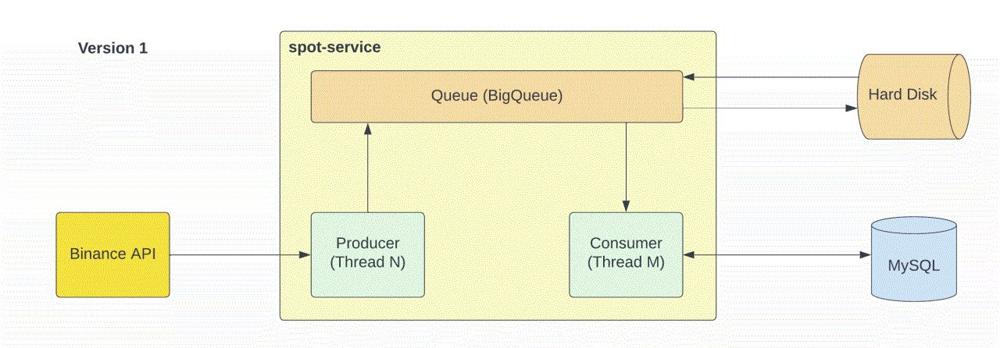
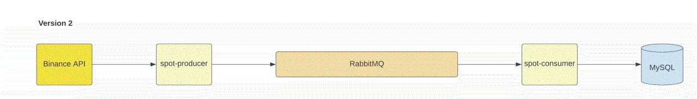

# binance-spot-service
binance-spot-service

This application is used to track the data of certain spots and add them to the database. 

How this app works:

With websocket helping, we receive a stream of data with some points of our spot. After that our Producer class 
takes this information and added it to our queue. After that from the queue we give this data to our Consumer class, 
and for better security and isolation, we add this data to our HDD/SSD. After all, our Consumer adds the converted information
to our DB.

For Application start:

1. cd <project_folder>/docker
   docker-compose up

2. Set required spot trades in the ../BinanceSpotService/src/main/resources/application.properties
   Example:
   "spot.trades=BTCUSDT,ETHUSDT"  

3. Run service
